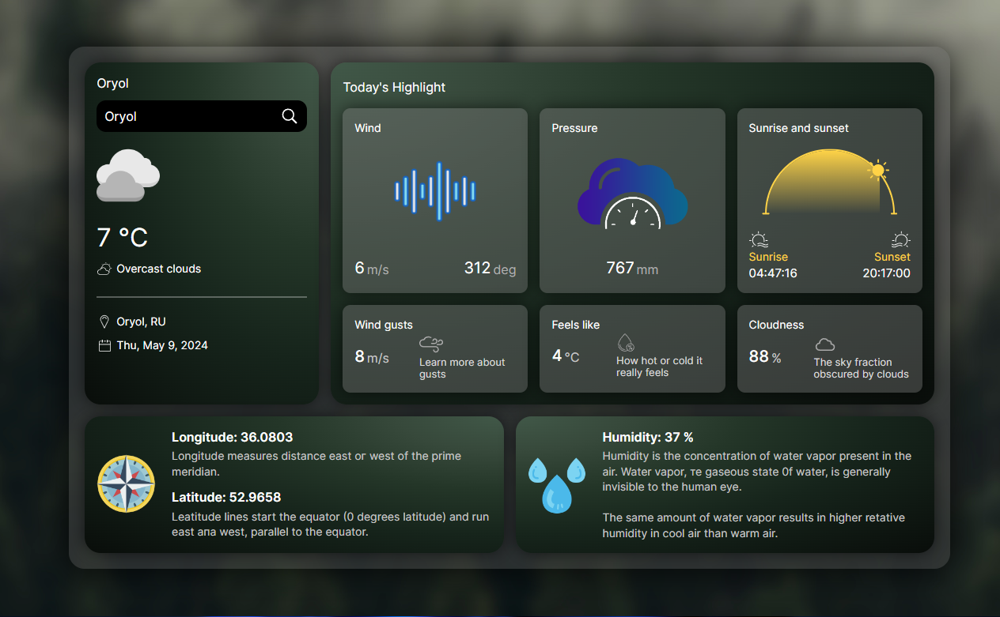

<h1 align="center">Weather App</h1>
<div align="center" id="top">

</div>
&#xa0;


<p align="center">
  

  

  

  

  
</p>


<p align="center">
  <a href="#dart-about">About</a> &#xa0; | &#xa0; 
  <a href="#sparkles-features">Features</a> &#xa0; | &#xa0;
  <a href="#rocket-technologies">Technologies</a> &#xa0; | &#xa0;
  <a href="#white_check_mark-requirements">Requirements</a> &#xa0; | &#xa0;
  <a href="#checkered_flag-starting">Starting</a> &#xa0; | &#xa0;
  <a href="#memo-license">License</a> &#xa0; | &#xa0;
  <a href="https://github.com/matmon12" target="_blank">Author</a>
</p>

<br>

## :dart: About

Website for obtaining information about the current weather in any city. Obtaining weather information is implemented using the OpenWeatherMap API.

## :sparkles: Features

:heavy_check_mark: Entering a city into input and receiving weather information;\
:heavy_check_mark: Show an error window if the city is not found/entered with an error;\
:heavy_check_mark: Adaptive for mobile devices;\
:heavy_check_mark: Diagram to show the current position of the sun in the sky;

## :rocket: Technologies

The following tools were used in this project:

- [Vue](https://vuejs.org/)
- [Pinia](https://pinia.vuejs.org/)
- [Vite](https://vitejs.dev/)
- [PrimeVue](https://primevue.org/)
- [Axios](https://axios-http.com/)

## :white_check_mark: Requirements

Before starting :checkered_flag:, you need to have [Git](https://git-scm.com) and [Node](https://nodejs.org/en/) installed.

## :checkered_flag: Starting

```bash
# Clone this project
$ git clone https://github.com/matmon12/weather

# Access
$ cd weather

# Install dependencies
$ npm install

# Run the project
$ npm run dev

# Compiles and minifies for production
$ npm run build
```
### Vue 3 + Vite

This template should help get you started developing with Vue 3 in Vite. The template uses Vue 3 `<script setup>` SFCs, check out the [script setup docs](https://v3.vuejs.org/api/sfc-script-setup.html#sfc-script-setup) to learn more.

### Recommended IDE Setup

- [VS Code](https://code.visualstudio.com/) + [Volar](https://marketplace.visualstudio.com/items?itemName=Vue.volar) (and disable Vetur) + [TypeScript Vue Plugin (Volar)](https://marketplace.visualstudio.com/items?itemName=Vue.vscode-typescript-vue-plugin).

## :memo: License

This project is under license from MIT. For more details, see the [LICENSE](LICENSE) file.

Made with :heart: by <a href="https://github.com/matmon12" target="_blank">Matmon</a>

&#xa0;

<a href="#top">Back to top</a>
